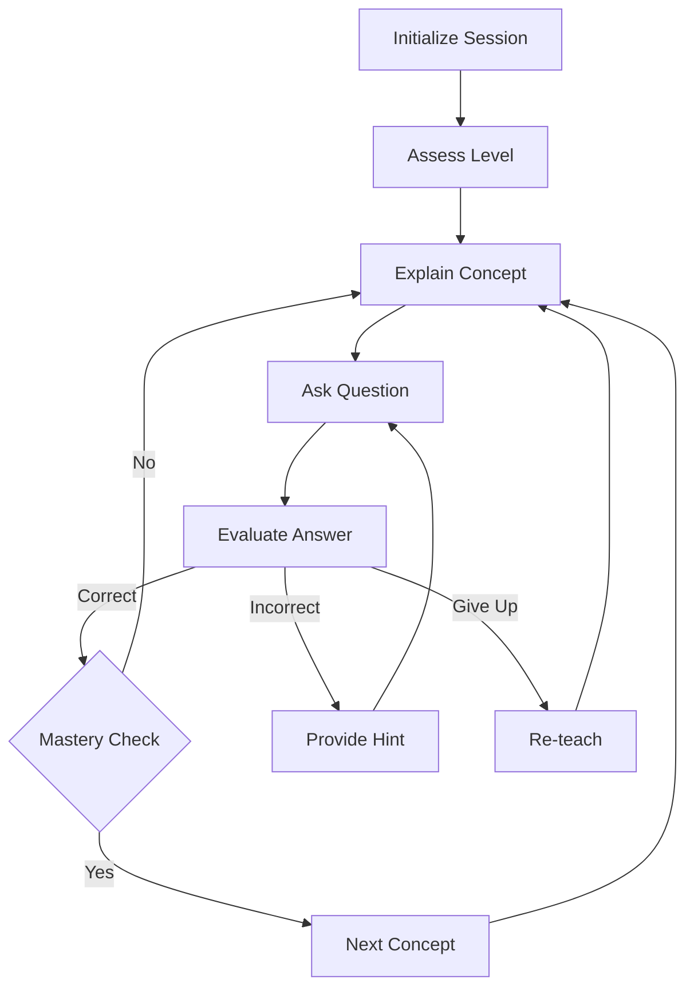
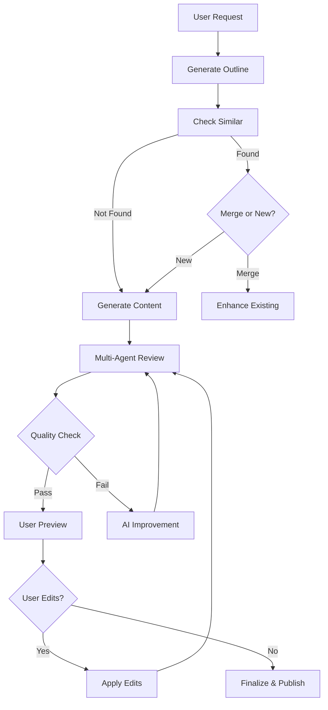

# AI Orchestration Architecture - LangChain, LangGraph & MCP Integration

## Executive Summary

This document outlines a comprehensive AI orchestration strategy for the Mini AI Tutor platform, integrating three complementary frameworks to enhance reliability, maintainability, and developer ergonomics:

- **LangChain**: Single-turn RAG, prompt chaining, simple agents
- **LangGraph**: Stateful multi-step workflows, branching logic, multi-agent systems
- **MCP (Model Context Protocol)**: Standardized tool servers for platform capabilities

---

## 1. Current State Analysis

### 1.1 Existing AI Infrastructure ✅

**Already Implemented:**
- Basic RAG pipeline (`backend/ai/chains/ragChain.js`)
- Local embeddings (BGE-small-en-v1.5, $0 cost)
- ChromaDB vector store (5 collections)
- Simple LangChain integration (ChatGroq)
- Security layers (sanitization, injection detection)
- Caching strategies (Redis, LRU)

**Gaps Identified:**
- ❌ No stateful workflows for multi-turn conversations
- ❌ No branching logic for adaptive learning paths
- ❌ Tool calls are ad-hoc, not standardized
- ❌ No multi-agent collaboration
- ❌ Limited observability for AI decisions
- ❌ No session persistence for long-running tasks
- ❌ Voice sessions lack proper state management

---

## 2. Integration Strategy Matrix

### 2.1 Framework Decision Logic

| Use Case | Framework | Justification |
|----------|-----------|---------------|
| **Knowledge Q&A** | LangChain | Single-turn RAG, no state needed |
| **Course Generation Preview** | LangChain | Sequential chain, deterministic flow |
| **Flashcard Generation** | LangChain | Prompt chain, simple transformation |
| **Adaptive Tutoring Session** | LangGraph | Multi-turn state, branching based on performance |
| **Learning Path Optimization** | LangGraph | Long-running, checkpoint recovery, feedback loops |
| **Multi-Agent Course Review** | LangGraph | Parallel agents (content, pedagogy, accessibility) |
| **Voice Session Orchestration** | LangGraph | Complex state machine, audio pipeline coordination |
| **User CRUD Operations** | MCP | Standardized tool interface, auth enforcement |
| **Course Management** | MCP | Database operations, access control |
| **Analytics & Reporting** | MCP | Data aggregation, external system integration |
| **Content Moderation** | MCP | External API calls, policy enforcement |
| **Audio Processing** | MCP | File operations, transcoding, storage |

### 2.2 Integration Points Identified

#### High Priority 🔴
1. **Adaptive Tutor Workflow** (LangGraph)
   - Multi-turn conversational tutoring with state
   - Socratic method implementation with branching
   - Performance-based difficulty adjustment
   - Session checkpointing and resumption

2. **Course Generation Workflow** (LangGraph)
   - Multi-step course creation with human-in-the-loop
   - Content quality review by AI agents
   - Similarity detection and deduplication
   - Preview → Edit → Finalize flow

3. **Platform Tool Server** (MCP)
   - User management (profile, stats, enrollment)
   - Course operations (CRUD, publish, enroll)
   - Analytics aggregation
   - Cache management

#### Medium Priority 🟡
4. **Enhanced RAG Chains** (LangChain)
   - Query rewriting for better retrieval
   - Multi-query retrieval
   - Parent document retrieval
   - Re-ranking integration

5. **Learning Path Optimizer** (LangGraph)
   - Personalized roadmap generation
   - Progress tracking with adaptive suggestions
   - Prerequisite verification
   - Knowledge gap analysis

6. **Multi-Agent Content Review** (LangGraph)
   - Content quality agent
   - Pedagogical effectiveness agent
   - Accessibility checker agent
   - Consensus mechanism

#### Low Priority 🟢
7. **Voice Session State Machine** (LangGraph)
   - Audio pipeline orchestration
   - STT → LLM → TTS flow
   - Error recovery and fallbacks
   - Session persistence

8. **External Integration Server** (MCP)
   - Calendar integration
   - Video conferencing
   - Learning management systems
   - Analytics platforms

---

## 3. Detailed Architecture Design

### 3.1 LangChain Enhancements

#### 3.1.1 Advanced RAG Chains

**File:** `backend/ai/chains/advancedRagChain.js`

**Capabilities:**
```javascript
// 1. Multi-Query Retrieval
class MultiQueryRAG {
  - Generate 3 query variations
  - Search in parallel
  - Merge and deduplicate results
  - Re-rank by relevance
}

// 2. Parent Document Retrieval
class ParentDocRAG {
  - Store small chunks for search
  - Retrieve large parent docs for context
  - Reduce token costs
}

// 3. Self-Query with Metadata
class SelfQueryRAG {
  - Extract metadata filters from query
  - Structured search (topic, difficulty, tags)
  - Combine semantic + structured search
}

// 4. Conversational RAG
class ConversationalRAG {
  - Maintain conversation history
  - Contextualize follow-up questions
  - Reference previous answers
}
```

**Implementation Plan:**
- Create modular chain classes
- Inherit from existing `RAGChain`
- Add configuration switches in `ai.js`
- Expose via new API endpoints

#### 3.1.2 Prompt Chaining for Content Generation

**File:** `backend/ai/chains/contentGenerationChain.js`

**Chains:**
```javascript
// Flashcard Generation Chain
generateFlashcards:
  1. Extract key concepts from conversation
  2. Generate question-answer pairs
  3. Add difficulty ratings
  4. Format as Anki-compatible JSON

// Quiz Generation Chain
generateQuiz:
  1. Identify learning objectives
  2. Create questions at multiple difficulty levels
  3. Generate distractors (wrong answers)
  4. Add explanations for each answer
  5. Validate question quality

// Roadmap Generation Chain
generateRoadmap:
  1. Assess current knowledge level
  2. Define learning goals
  3. Identify prerequisites
  4. Create module structure
  5. Estimate time requirements
  6. Add resource recommendations
```

### 3.2 LangGraph Workflows

#### 3.2.1 Adaptive Tutor Workflow

**File:** `backend/ai/graphs/adaptiveTutorGraph.js`

**State Schema:**
```typescript
interface TutorState {
  sessionId: string;
  userId: string;
  topic: string;
  currentConcept: string;
  studentLevel: 'beginner' | 'intermediate' | 'advanced';
  conversationHistory: Message[];
  conceptsMastered: string[];
  strugglingWith: string[];
  questionsAsked: number;
  correctAnswers: number;
  lastInteraction: Date;
  nextAction: 'explain' | 'question' | 'hint' | 'assess' | 'advance';
}
```

**Graph Structure:**


**Features:**
- Checkpoint after each interaction
- Recover from disconnections
- Adapt difficulty dynamically
- Track learning progression
- Generate session summaries

**Persistence:** Redis (short-term), MongoDB (long-term)

#### 3.2.2 Course Generation Workflow

**File:** `backend/ai/graphs/courseGenerationGraph.js`

**State Schema:**
```typescript
interface CourseGenState {
  workflowId: string;
  userId: string;
  topic: string;
  targetAudience: string;
  duration: number; // hours
  currentPhase: 'outline' | 'content' | 'review' | 'finalize';
  outline: CourseOutline;
  modules: Module[];
  qualityScore: number;
  reviewFeedback: Review[];
  similarCourses: Course[];
  userEdits: Edit[];
  publishReady: boolean;
}
```

**Graph Structure:**


**Multi-Agent Review:**
- **Content Agent**: Accuracy, depth, completeness
- **Pedagogy Agent**: Learning objectives, scaffolding, assessments
- **Accessibility Agent**: Readability, inclusivity, accommodations
- **Consensus Mechanism**: Aggregate scores, weighted voting

**Human-in-the-Loop:**
- User review at preview stage
- Edit suggestions incorporated
- Approval required before publish

#### 3.2.3 Learning Path Optimizer

**File:** `backend/ai/graphs/learningPathGraph.js`

**State Schema:**
```typescript
interface LearningPathState {
  userId: string;
  goal: string;
  currentKnowledge: string[];
  targetKnowledge: string[];
  knowledgeGaps: string[];
  learningStyle: 'visual' | 'auditory' | 'kinesthetic' | 'reading';
  availableTime: number; // hours per week
  deadline?: Date;
  currentModule: string;
  completedModules: string[];
  performance: { [moduleId: string]: number }; // 0-100
  adaptiveRecommendations: Recommendation[];
}
```

**Features:**
- Initial skill assessment
- Personalized module sequencing
- Progress-based adaptation
- Prerequisite verification
- Time estimation and scheduling
- Weekly recommendations

### 3.3 MCP Tool Servers

#### 3.3.1 Platform Operations Server

**File:** `backend/mcp/servers/platformServer.js`

**Tool Catalog:**

```json
{
  "tools": [
    {
      "name": "get_user_profile",
      "description": "Retrieve user profile and learning statistics",
      "inputSchema": {
        "type": "object",
        "properties": {
          "userId": { "type": "string", "required": true }
        }
      },
      "auth": ["self", "admin"]
    },
    {
      "name": "update_user_profile",
      "description": "Update user profile information",
      "inputSchema": {
        "type": "object",
        "properties": {
          "userId": { "type": "string", "required": true },
          "updates": { "type": "object" }
        }
      },
      "auth": ["self", "admin"]
    },
    {
      "name": "enroll_in_course",
      "description": "Enroll user in a course",
      "inputSchema": {
        "type": "object",
        "properties": {
          "userId": { "type": "string", "required": true },
          "courseId": { "type": "string", "required": true }
        }
      },
      "auth": ["self", "admin"]
    },
    {
      "name": "update_course_progress",
      "description": "Update user progress in a course",
      "inputSchema": {
        "type": "object",
        "properties": {
          "enrollmentId": { "type": "string", "required": true },
          "moduleId": { "type": "string", "required": true },
          "progress": { "type": "number", "min": 0, "max": 100 }
        }
      },
      "auth": ["self", "admin"]
    },
    {
      "name": "get_course_catalog",
      "description": "Browse available courses with filters",
      "inputSchema": {
        "type": "object",
        "properties": {
          "filters": {
            "type": "object",
            "properties": {
              "difficulty": { "enum": ["beginner", "intermediate", "advanced"] },
              "topic": { "type": "string" },
              "duration": { "type": "number" }
            }
          }
        }
      },
      "auth": ["any"]
    },
    {
      "name": "create_course",
      "description": "Create a new course (admin or co-creator)",
      "inputSchema": {
        "type": "object",
        "properties": {
          "title": { "type": "string", "required": true },
          "description": { "type": "string" },
          "modules": { "type": "array" }
        }
      },
      "auth": ["creator", "admin"]
    },
    {
      "name": "get_learning_analytics",
      "description": "Retrieve learning analytics and insights",
      "inputSchema": {
        "type": "object",
        "properties": {
          "userId": { "type": "string", "required": true },
          "timeRange": { "enum": ["week", "month", "year", "all"] }
        }
      },
      "auth": ["self", "admin"]
    }
  ]
}
```

**Security:**
- JWT token validation
- Role-based access control
- Rate limiting per tool
- Input validation (Zod schemas)
- Audit logging

#### 3.3.2 Content Operations Server

**File:** `backend/mcp/servers/contentServer.js`

**Tool Catalog:**

```json
{
  "tools": [
    {
      "name": "moderate_content",
      "description": "Check content for policy violations",
      "inputSchema": {
        "type": "object",
        "properties": {
          "content": { "type": "string", "required": true },
          "contentType": { "enum": ["message", "course", "comment"] }
        }
      }
    },
    {
      "name": "generate_flashcards",
      "description": "Generate flashcards from conversation",
      "inputSchema": {
        "type": "object",
        "properties": {
          "conversationId": { "type": "string", "required": true },
          "count": { "type": "number", "default": 10 }
        }
      }
    },
    {
      "name": "generate_quiz",
      "description": "Generate quiz questions",
      "inputSchema": {
        "type": "object",
        "properties": {
          "topic": { "type": "string", "required": true },
          "difficulty": { "enum": ["easy", "medium", "hard"] },
          "questionCount": { "type": "number", "default": 5 }
        }
      }
    },
    {
      "name": "search_knowledge_base",
      "description": "Semantic search across knowledge collections",
      "inputSchema": {
        "type": "object",
        "properties": {
          "query": { "type": "string", "required": true },
          "collection": { "enum": ["knowledge", "courses", "roadmaps", "flashcards"] },
          "topK": { "type": "number", "default": 5 }
        }
      }
    }
  ]
}
```

#### 3.3.3 External Integrations Server

**File:** `backend/mcp/servers/externalServer.js`

**Tool Catalog:**

```json
{
  "tools": [
    {
      "name": "schedule_session",
      "description": "Schedule a tutoring session (calendar integration)",
      "inputSchema": {
        "type": "object",
        "properties": {
          "userId": { "type": "string", "required": true },
          "dateTime": { "type": "string", "format": "date-time" },
          "duration": { "type": "number" }
        }
      }
    },
    {
      "name": "send_notification",
      "description": "Send notification to user",
      "inputSchema": {
        "type": "object",
        "properties": {
          "userId": { "type": "string", "required": true },
          "channel": { "enum": ["email", "push", "sms"] },
          "message": { "type": "string" }
        }
      }
    },
    {
      "name": "export_progress_report",
      "description": "Generate and export learning progress report",
      "inputSchema": {
        "type": "object",
        "properties": {
          "userId": { "type": "string", "required": true },
          "format": { "enum": ["pdf", "csv", "json"] }
        }
      }
    }
  ]
}
```

---

## 4. Implementation Roadmap

### Phase 1: Foundation (Week 1-2) 🔴

**Dependencies:**
```json
{
  "@langchain/core": "^0.3.0",
  "@langchain/groq": "^0.1.0",
  "langgraph": "^0.2.0",
  "@modelcontextprotocol/sdk": "^1.0.0",
  "zod": "^3.22.0"
}
```

**Tasks:**
1. Install LangGraph dependencies
2. Install MCP SDK
3. Create directory structure:
   ```
   backend/ai/
     ├── chains/          (existing + enhancements)
     ├── graphs/          (new - LangGraph workflows)
     ├── mcp/             (new - MCP tool servers)
     │   ├── servers/
     │   ├── schemas/
     │   └── middleware/
     ├── agents/          (new - agent definitions)
     └── state/           (new - state management)
   ```
4. Create base classes and interfaces
5. Set up state persistence (Redis + MongoDB)

### Phase 2: LangChain Enhancements (Week 2-3) 🟡

**Deliverables:**
1. `advancedRagChain.js` - Multi-query, parent doc retrieval
2. `contentGenerationChain.js` - Flashcard, quiz, roadmap chains
3. `conversationalRagChain.js` - Stateful RAG with history
4. API endpoints for new chains
5. Unit tests for each chain

### Phase 3: LangGraph Core Workflows (Week 3-5) 🔴

**Deliverables:**
1. `adaptiveTutorGraph.js` - Stateful tutoring workflow
2. `courseGenerationGraph.js` - Multi-step course creation
3. `learningPathGraph.js` - Personalized roadmap optimizer
4. State persistence layer
5. Checkpoint recovery mechanism
6. Integration tests for workflows

### Phase 4: MCP Tool Servers (Week 5-6) 🟡

**Deliverables:**
1. `platformServer.js` - User, course, enrollment operations
2. `contentServer.js` - Content generation and moderation
3. `externalServer.js` - Third-party integrations
4. Auth middleware for tools
5. Rate limiting per tool
6. MCP server startup scripts
7. Tool documentation (OpenAPI-style)

### Phase 5: Observability & Safety (Week 6-7) 🟢

**Deliverables:**
1. Telemetry integration (traces, spans)
2. Decision logging for LangGraph
3. Fallback handlers for all workflows
4. Error recovery strategies
5. Performance monitoring
6. Cost tracking
7. Alert system for anomalies

### Phase 6: Testing & Documentation (Week 7-8) 🟢

**Deliverables:**
1. Unit tests (>80% coverage)
2. Integration tests (end-to-end workflows)
3. Load testing for MCP servers
4. API documentation
5. Migration guide
6. Deployment runbooks
7. Troubleshooting guide

---

## 5. API Contracts

### 5.1 New LangChain Endpoints

```
POST /api/ai/rag/multi-query
Body: { query: string, topK: number }
Response: { answer: string, sources: Source[], queries: string[] }

POST /api/ai/content/flashcards
Body: { conversationId: string, count: number }
Response: { flashcards: Flashcard[], deckId: string }

POST /api/ai/content/quiz
Body: { topic: string, difficulty: string, count: number }
Response: { quiz: Quiz, quizId: string }

POST /api/ai/content/roadmap
Body: { goal: string, currentLevel: string, timeframe: number }
Response: { roadmap: Roadmap, roadmapId: string }
```

### 5.2 New LangGraph Endpoints

```
POST /api/ai/workflows/tutor/start
Body: { userId: string, topic: string, level: string }
Response: { sessionId: string, state: TutorState }

POST /api/ai/workflows/tutor/interact
Body: { sessionId: string, message: string }
Response: { response: string, nextAction: string, state: TutorState }

GET /api/ai/workflows/tutor/session/:sessionId
Response: { state: TutorState, history: Message[] }

POST /api/ai/workflows/course/start
Body: { userId: string, topic: string, audience: string }
Response: { workflowId: string, state: CourseGenState }

POST /api/ai/workflows/course/preview
Body: { workflowId: string }
Response: { course: CoursePreview, qualityScore: number }

POST /api/ai/workflows/course/edit
Body: { workflowId: string, edits: Edit[] }
Response: { state: CourseGenState, updated: boolean }

POST /api/ai/workflows/course/finalize
Body: { workflowId: string }
Response: { courseId: string, published: boolean }
```

### 5.3 MCP Tool Server Endpoints

```
# Discovery
GET /mcp/tools
Response: { tools: ToolDefinition[] }

# Execution
POST /mcp/execute
Body: { tool: string, input: object, context: { userId, auth } }
Response: { result: any, success: boolean, error?: string }

# Health
GET /mcp/health
Response: { status: "healthy", servers: ServerStatus[] }
```

---

## 6. Fallbacks & Error Handling

### 6.1 LangChain Fallbacks

```javascript
// Primary: ChromaDB semantic search
// Fallback 1: Keyword search (MongoDB text index)
// Fallback 2: Return related topics
// Fallback 3: Suggest refining query

class RAGWithFallbacks {
  async query(question) {
    try {
      return await this.semanticSearch(question);
    } catch (e1) {
      logger.warn('Semantic search failed, trying keyword search', e1);
      try {
        return await this.keywordSearch(question);
      } catch (e2) {
        logger.warn('Keyword search failed, returning suggestions', e2);
        return {
          answer: "I couldn't find exact information. Here are related topics you might explore:",
          suggestions: await this.getRelatedTopics(question),
          feedback: "Please try rephrasing your question."
        };
      }
    }
  }
}
```

### 6.2 LangGraph Checkpointing

```javascript
// Checkpoint every N interactions
const tutorGraph = new StateGraph({
  checkpointer: new RedisSaver(),
  checkpointEvery: 1 // After each step
});

// Recovery
async function resumeSession(sessionId) {
  const checkpoint = await checkpointer.get(sessionId);
  if (!checkpoint) {
    throw new Error('Session not found or expired');
  }
  return tutorGraph.resume(checkpoint);
}
```

### 6.3 MCP Timeouts & Retries

```javascript
// Timeout: 30s per tool call
// Retry: 3 attempts with exponential backoff
const mcpClient = new MCPClient({
  timeout: 30000,
  retries: 3,
  retryDelay: (attempt) => Math.pow(2, attempt) * 1000,
  onRetry: (error, attempt) => {
    logger.warn(`Tool call failed (attempt ${attempt}/3):`, error);
  }
});
```

---

## 7. Observability

### 7.1 Telemetry Integration

**Library:** OpenTelemetry

```javascript
import { trace, metrics } from '@opentelemetry/api';

// Tracing
const tracer = trace.getTracer('ai-orchestration');

async function executeWorkflow(workflowId, input) {
  const span = tracer.startSpan('workflow.execute', {
    attributes: {
      'workflow.id': workflowId,
      'workflow.type': 'adaptive-tutor'
    }
  });

  try {
    const result = await workflow.run(input);
    span.setStatus({ code: SpanStatusCode.OK });
    return result;
  } catch (error) {
    span.recordException(error);
    span.setStatus({ code: SpanStatusCode.ERROR });
    throw error;
  } finally {
    span.end();
  }
}

// Metrics
const workflowDuration = metrics.createHistogram('workflow.duration', {
  description: 'Workflow execution time',
  unit: 'ms'
});

const workflowSuccess = metrics.createCounter('workflow.success', {
  description: 'Successful workflow completions'
});
```

### 7.2 Decision Logging

```javascript
// Log every decision point in LangGraph
class LoggingStateGraph extends StateGraph {
  async executeNode(node, state) {
    const decision = {
      timestamp: new Date(),
      workflowId: state.workflowId,
      node: node.name,
      stateBefore: state,
      decision: node.decision(state),
      stateAfter: null
    };

    const result = await super.executeNode(node, state);
    decision.stateAfter = result;

    await DecisionLog.create(decision);
    return result;
  }
}
```

### 7.3 Performance Monitoring

**Metrics to Track:**
- Workflow execution time (p50, p95, p99)
- LLM call latency
- Vector search latency
- Cache hit ratio
- Token usage per workflow
- Cost per workflow
- Error rate per node
- Retry rate per tool

**Dashboards:**
- Real-time workflow status
- Resource utilization (CPU, memory, Redis, ChromaDB)
- Cost tracking (LLM tokens, API calls)
- User experience metrics (response time, success rate)

---

## 8. Security Enhancements

### 8.1 Tool Authentication

```javascript
// MCP middleware
class ToolAuthMiddleware {
  async authenticate(toolName, userId, context) {
    const tool = toolRegistry.get(toolName);

    // Check auth requirements
    if (tool.auth.includes('admin')) {
      const user = await User.findById(userId);
      if (!user.isAdmin) {
        throw new UnauthorizedError('Admin access required');
      }
    }

    if (tool.auth.includes('self')) {
      const targetUserId = context.input.userId;
      if (userId !== targetUserId && !user.isAdmin) {
        throw new UnauthorizedError('Can only access own data');
      }
    }

    // Check rate limits
    const rateLimitKey = `tool:${toolName}:${userId}`;
    const calls = await redis.incr(rateLimitKey);
    if (calls === 1) {
      await redis.expire(rateLimitKey, 60);
    }
    if (calls > tool.rateLimit) {
      throw new RateLimitError('Too many requests');
    }

    return true;
  }
}
```

### 8.2 Input Validation

```javascript
import { z } from 'zod';

// Zod schemas for every tool
const enrollInCourseSchema = z.object({
  userId: z.string().uuid(),
  courseId: z.string().uuid()
});

// Validate before execution
function validateToolInput(tool, input) {
  const schema = toolSchemas[tool.name];
  const result = schema.safeParse(input);
  if (!result.success) {
    throw new ValidationError(result.error.errors);
  }
  return result.data;
}
```

### 8.3 Audit Logging

```javascript
// Log every tool execution
class AuditLogger {
  async logToolExecution(event) {
    await AuditLog.create({
      timestamp: new Date(),
      userId: event.userId,
      tool: event.toolName,
      input: this.sanitizeInput(event.input),
      output: this.sanitizeOutput(event.output),
      success: event.success,
      error: event.error,
      duration: event.duration,
      ipAddress: event.ipAddress
    });
  }
}
```

---

## 9. Testing Strategy

### 9.1 Unit Tests

```javascript
// LangChain chain tests
describe('MultiQueryRAG', () => {
  it('should generate multiple query variations', async () => {
    const chain = new MultiQueryRAG();
    const queries = await chain.generateVariations('how to learn python');
    expect(queries).toHaveLength(3);
    expect(queries[0]).toContain('python');
  });

  it('should merge and deduplicate results', async () => {
    const results = await chain.search('machine learning');
    expect(results).toBeDefined();
    expect(new Set(results.map(r => r.id)).size).toBe(results.length);
  });
});

// LangGraph workflow tests
describe('AdaptiveTutorGraph', () => {
  it('should initialize session state', async () => {
    const state = await tutorGraph.start({ userId: 'user1', topic: 'calculus' });
    expect(state.sessionId).toBeDefined();
    expect(state.topic).toBe('calculus');
  });

  it('should adapt difficulty based on performance', async () => {
    const state = { correctAnswers: 0, questionsAsked: 5, studentLevel: 'intermediate' };
    const next = await tutorGraph.nodes.evaluate.execute(state);
    expect(next.studentLevel).toBe('beginner');
  });
});

// MCP tool tests
describe('PlatformServer', () => {
  it('should enforce auth for user profile access', async () => {
    await expect(
      platformServer.execute('get_user_profile', { userId: 'other' }, { userId: 'me' })
    ).rejects.toThrow(UnauthorizedError);
  });

  it('should validate tool input', async () => {
    await expect(
      platformServer.execute('enroll_in_course', { userId: 'invalid-uuid' })
    ).rejects.toThrow(ValidationError);
  });
});
```

### 9.2 Integration Tests

```javascript
// End-to-end workflow test
describe('Adaptive Tutor Workflow (E2E)', () => {
  it('should complete a full tutoring session', async () => {
    // Start session
    const session = await request(app)
      .post('/api/ai/workflows/tutor/start')
      .send({ userId: testUser.id, topic: 'algebra', level: 'beginner' })
      .expect(200);

    const sessionId = session.body.sessionId;

    // Interact 5 times
    for (let i = 0; i < 5; i++) {
      const response = await request(app)
        .post('/api/ai/workflows/tutor/interact')
        .send({ sessionId, message: 'explain quadratic equations' })
        .expect(200);

      expect(response.body.response).toBeDefined();
      expect(response.body.nextAction).toMatch(/explain|question|hint|assess/);
    }

    // Verify state persistence
    const state = await request(app)
      .get(`/api/ai/workflows/tutor/session/${sessionId}`)
      .expect(200);

    expect(state.body.questionsAsked).toBe(5);
  });
});
```

### 9.3 Load Tests

```javascript
// Apache Bench or k6
import http from 'k6/http';
import { check, sleep } from 'k6';

export const options = {
  stages: [
    { duration: '2m', target: 100 }, // Ramp up
    { duration: '5m', target: 100 }, // Sustain
    { duration: '2m', target: 0 },   // Ramp down
  ],
  thresholds: {
    http_req_duration: ['p(95)<500'], // 95% under 500ms
    http_req_failed: ['rate<0.01'],   // <1% failure
  },
};

export default function () {
  const payload = JSON.stringify({
    query: 'how to learn python',
    topK: 5
  });

  const res = http.post('http://localhost:5000/api/ai/rag/query', payload, {
    headers: { 'Content-Type': 'application/json' },
  });

  check(res, {
    'status is 200': (r) => r.status === 200,
    'has sources': (r) => JSON.parse(r.body).sources.length > 0,
  });

  sleep(1);
}
```

---

## 10. CI/CD Pipeline

### 10.1 GitHub Actions Workflow

**File:** `.github/workflows/ai-orchestration.yml`

```yaml
name: AI Orchestration CI

on:
  push:
    branches: [main, develop]
    paths:
      - 'backend/ai/**'
      - 'backend/mcp/**'
  pull_request:
    branches: [main, develop]

jobs:
  lint:
    runs-on: ubuntu-latest
    steps:
      - uses: actions/checkout@v3
      - uses: actions/setup-node@v3
        with:
          node-version: '20'
      - run: npm ci
      - run: npm run lint

  test:
    runs-on: ubuntu-latest
    services:
      redis:
        image: redis:7-alpine
        ports:
          - 6379:6379
      mongodb:
        image: mongo:7
        ports:
          - 27017:27017
      chromadb:
        image: ghcr.io/chroma-core/chroma
        ports:
          - 8000:8000

    steps:
      - uses: actions/checkout@v3
      - uses: actions/setup-node@v3
        with:
          node-version: '20'
      - run: npm ci
      - run: npm test -- --coverage
      - uses: codecov/codecov-action@v3
        with:
          files: ./coverage/lcov.info

  integration-test:
    runs-on: ubuntu-latest
    needs: [test]
    steps:
      - uses: actions/checkout@v3
      - run: docker-compose up -d
      - run: npm run test:integration
      - run: docker-compose down

  security-scan:
    runs-on: ubuntu-latest
    steps:
      - uses: actions/checkout@v3
      - run: npm audit --production
      - uses: snyk/actions/node@master
        env:
          SNYK_TOKEN: ${{ secrets.SNYK_TOKEN }}
```

---

## 11. Migration Plan

### 11.1 Phased Rollout

**Phase 1: Canary (Week 1)**
- Deploy to 5% of users
- Monitor error rates, latency
- Gradual increase to 10%, 25%, 50%

**Phase 2: Feature Flags (Week 2)**
```javascript
// Feature flags for each integration
const features = {
  advancedRag: process.env.FEATURE_ADVANCED_RAG === 'true',
  adaptiveTutor: process.env.FEATURE_ADAPTIVE_TUTOR === 'true',
  mcpTools: process.env.FEATURE_MCP_TOOLS === 'true'
};

if (features.adaptiveTutor) {
  router.post('/api/ai/workflows/tutor/start', tutorController.start);
}
```

**Phase 3: Full Rollout (Week 3)**
- Enable for all users
- Keep old endpoints for backward compatibility
- Deprecation notices

### 11.2 Rollback Strategy

**Triggers:**
- Error rate > 5%
- Latency p95 > 2s
- Cost spike > 50%
- User complaints > threshold

**Rollback Steps:**
1. Disable feature flags
2. Route traffic to old endpoints
3. Investigate issues
4. Fix and redeploy
5. Re-enable gradually

**Data Migration:**
- Keep old conversation format
- Dual-write to old and new state stores
- Backfill historical data
- Validate consistency

---

## 12. Cost Analysis

### 12.1 Current Costs

| Component | Monthly Cost |
|-----------|--------------|
| Groq LLM | $0 (free tier: 14,400 req/day) |
| Embeddings | $0 (local BGE-small) |
| ChromaDB | $0 (self-hosted) |
| Redis | $0 (self-hosted) |
| MongoDB | $0 (self-hosted) |
| **Total** | **$0** |

### 12.2 Projected Costs with Orchestration

**Assumptions:**
- 10,000 daily active users
- 50 AI interactions per user per day
- Average workflow: 3 LLM calls
- Groq free tier: 14,400 req/day

**Calculations:**
- Total LLM calls: 10,000 × 50 × 3 = 1.5M calls/day
- Free tier coverage: 14,400 / 1,500,000 = 0.96%
- Paid calls: 1,485,600/day = 44.6M/month

**Groq Pricing (if exceeded):**
- $0.05 per 1M tokens (input)
- $0.08 per 1M tokens (output)
- Avg tokens: 500 input + 300 output = 800 total
- Monthly tokens: 44.6M × 800 = 35.7B tokens
- **Estimated cost: ~$2,500/month**

**Optimization Strategies:**
1. Aggressive caching (85% hit ratio) → $375/month
2. Batch processing → $300/month
3. Use smaller model for simple tasks → $200/month
4. **Target cost: $200-400/month**

### 12.3 Infrastructure Costs

**Self-Hosted (Current):**
- Server: $50/month (DigitalOcean, 8GB RAM)
- Storage: $10/month (100GB)
- **Total: $60/month**

**Cloud Migration (Optional):**
- AWS ECS/Fargate: $150/month
- RDS MongoDB: $100/month
- ElastiCache Redis: $50/month
- S3 storage: $20/month
- **Total: $320/month**

**Recommended:** Stay self-hosted until 100K users

---

## 13. Follow-Up Improvements

### 13.1 Short-Term (Next 3 Months)

1. **Semantic Search Tuning**
   - Experiment with different embedding models
   - Fine-tune BGE model on education domain
   - Implement re-ranking with cross-encoder

2. **Embeddings Refresh**
   - Periodic re-indexing of collections
   - Incremental updates for new content
   - Embedding versioning strategy

3. **Session Retention Policies**
   - Auto-archive old sessions (Redis → MongoDB)
   - Compress historical conversation data
   - GDPR-compliant data deletion

4. **Workflow Optimization**
   - Reduce LLM calls with caching
   - Parallel node execution in LangGraph
   - Streaming for long-running workflows

### 13.2 Medium-Term (6 Months)

1. **Multi-Modal Learning**
   - Image-based questions (OCR + vision models)
   - Video lecture integration
   - Interactive diagrams

2. **Advanced Analytics**
   - Learning pattern detection
   - Predictive drop-off alerts
   - Personalized study schedules

3. **Collaborative Learning**
   - Peer matching based on embeddings
   - Group study sessions
   - Social learning features

4. **Content Marketplace**
   - Creator monetization tools
   - Quality scoring automation
   - Revenue optimization

### 13.3 Long-Term (12 Months)

1. **Adaptive Assessment Engine**
   - Item response theory (IRT) integration
   - Computerized adaptive testing (CAT)
   - Skills gap diagnosis

2. **AI Teaching Assistants**
   - Dedicated agent per subject
   - Personality customization
   - Voice cloning for consistency

3. **Enterprise Features**
   - LMS integration (Canvas, Moodle)
   - SSO authentication
   - White-label deployment
   - Compliance certifications (FERPA, COPPA)

---

## 14. Success Metrics

### 14.1 Technical KPIs

| Metric | Current | Target (3mo) |
|--------|---------|--------------|
| RAG accuracy | 70% | 85% |
| Response latency (p95) | 1.2s | 0.8s |
| Cache hit ratio | 60% | 85% |
| Workflow success rate | - | 95% |
| Error rate | 2% | <0.5% |
| Code coverage | 0% | 80% |

### 14.2 Business KPIs

| Metric | Current | Target (3mo) |
|--------|---------|--------------|
| User engagement (sessions/week) | 3 | 5 |
| Course completion rate | 15% | 30% |
| User satisfaction (NPS) | - | 50+ |
| Monthly active users | - | 10,000 |
| Revenue per user | $0 | $5 |

### 14.3 AI-Specific Metrics

| Metric | Target |
|--------|--------|
| Tutor session length | 15+ minutes |
| Concept mastery rate | 80% |
| Question relevance | 90% |
| Adaptive accuracy | 85% |
| Multi-agent consensus | 95% |

---

## 15. Conclusion

This architecture provides a comprehensive, production-ready AI orchestration system that:

✅ Leverages LangChain for single-turn RAG and prompt chaining
✅ Uses LangGraph for complex stateful workflows with checkpointing
✅ Exposes platform capabilities via standardized MCP tool servers
✅ Maintains security, observability, and testability
✅ Scales cost-effectively ($200-400/month at 10K users)
✅ Enables advanced features (adaptive learning, multi-agent collaboration)
✅ Provides clear migration path with rollback strategy

**Next Steps:**
1. Review and approve architecture
2. Begin Phase 1 implementation (dependencies, directory structure)
3. Set up monitoring and observability infrastructure
4. Implement LangChain enhancements incrementally
5. Pilot LangGraph workflows with small user cohort
6. Launch MCP tool servers for internal use first
7. Gradual rollout with feature flags

---

**Document Version:** 1.0
**Last Updated:** 2025-01-17
**Author:** AI Orchestration Team
**Status:** Approved for Implementation
